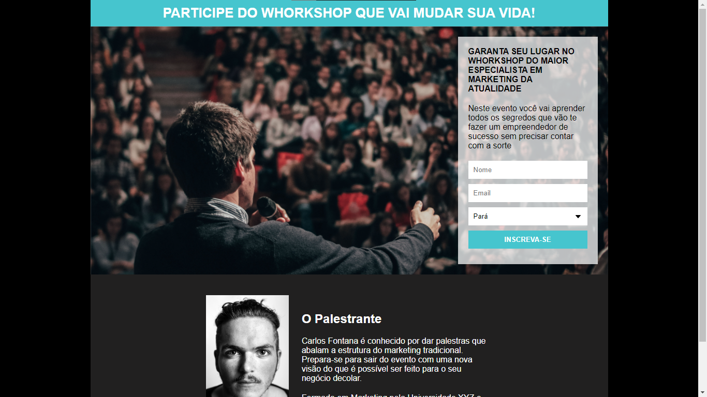
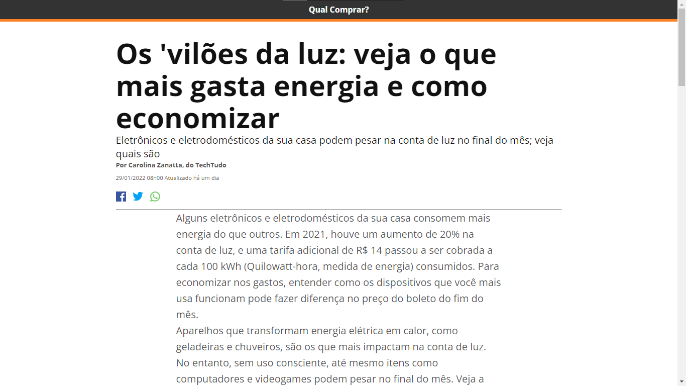
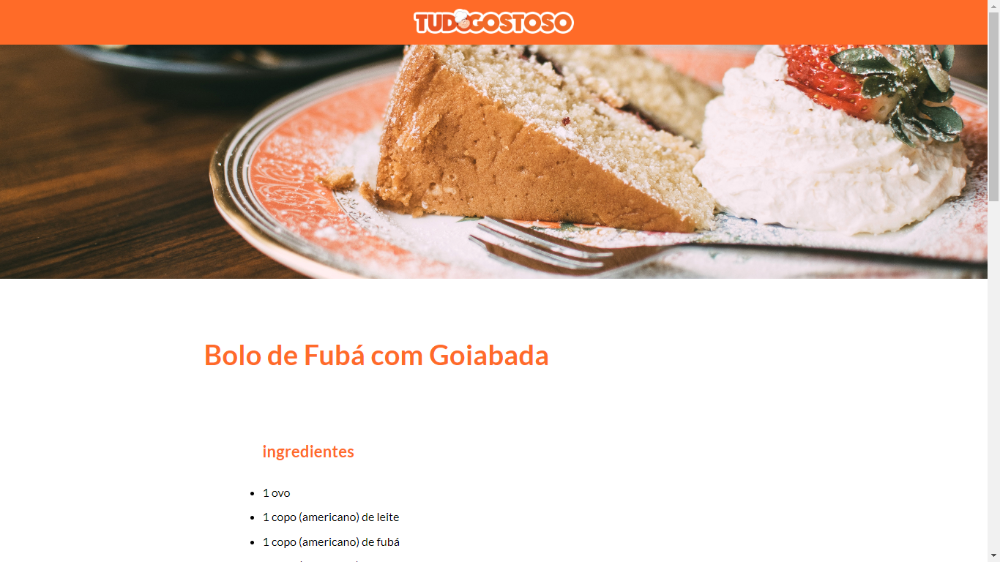
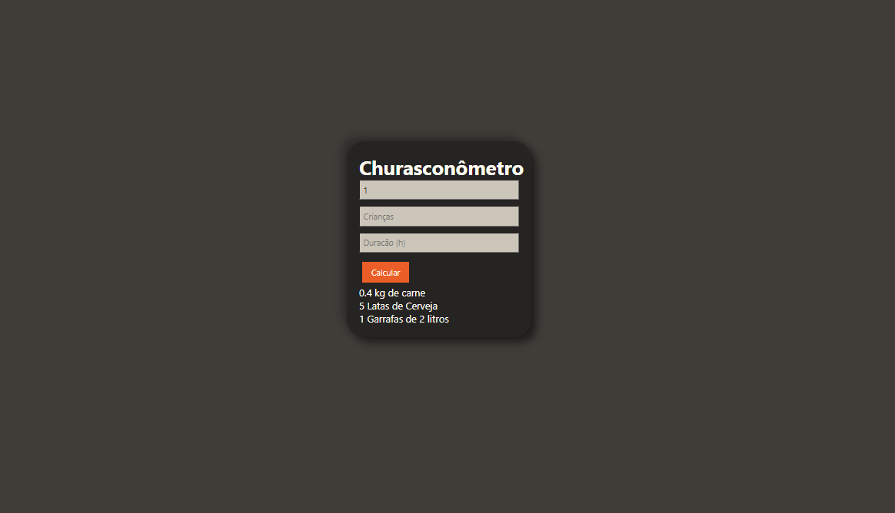
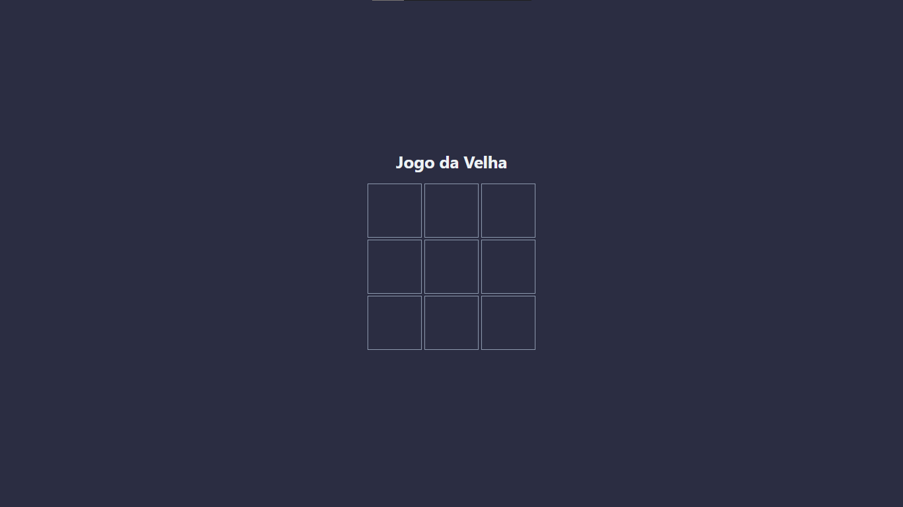
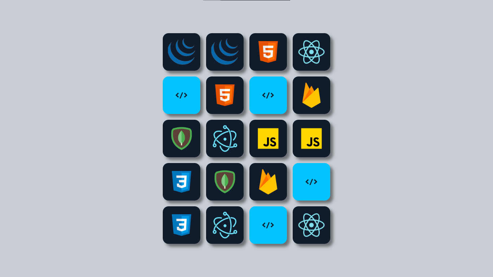

# Projetos do meu curso

Visitar projetos :
* [Pagina de Captura](https://alexandrekosh.github.io/projetos-curso/site-captura/)
* [Pagina de economia de energia](https://alexandrekosh.github.io/projetos-curso/pagina-energia/)
* [Pagina de Receita](https://alexandrekosh.github.io/projetos-curso/pagina-receita/)
* [Churrasconometro](https://alexandrekosh.github.io/projetos-curso/churrasconometro/)
* [Jogo da Velha](https://alexandrekosh.github.io/projetos-curso/jdv/)
* [Jogo da Memoria](https://alexandrekosh.github.io/projetos-curso/jdm/)

 

## 💻 Projetos: 

### Pagina de Captura

 

### Site de Economia de Energia

 

### Pagina de Receitas

 

### Churrasconometro

 

### Jogo da Velha

 

### Jogo da Memoria

